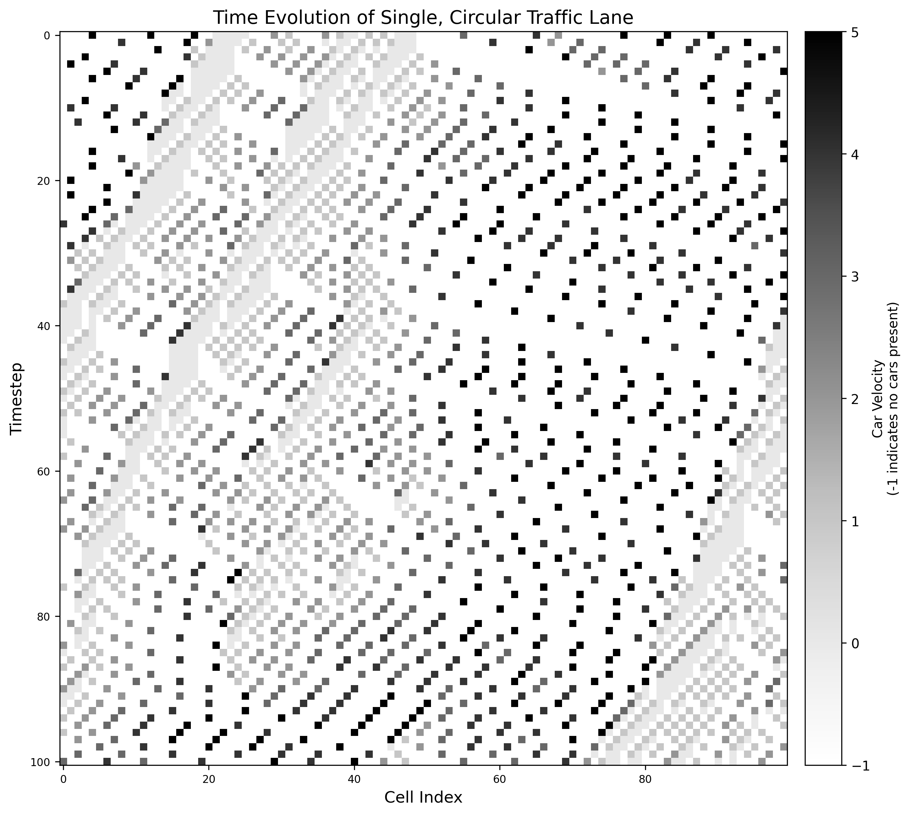
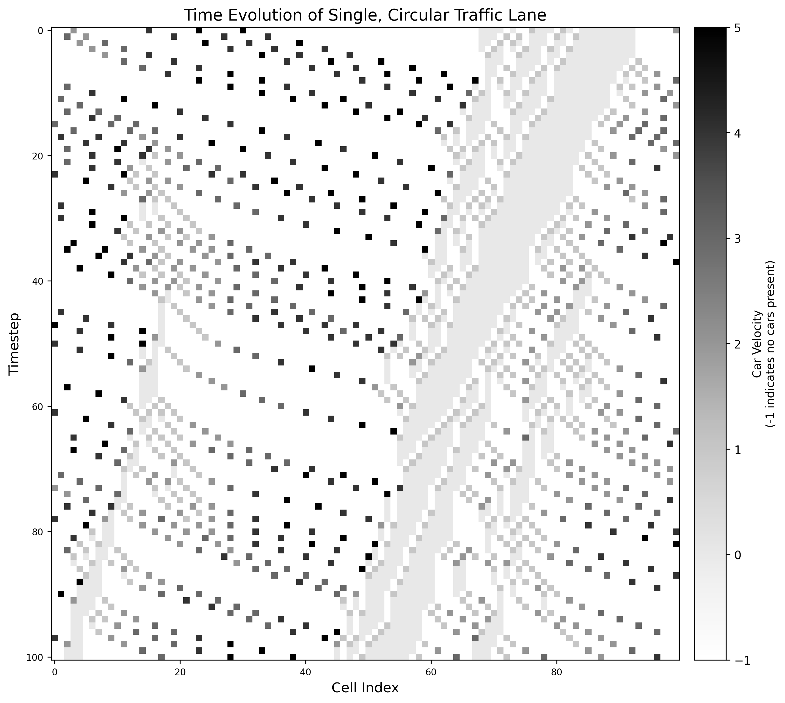
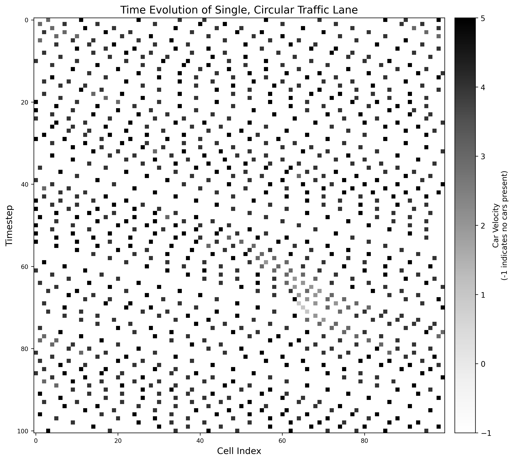
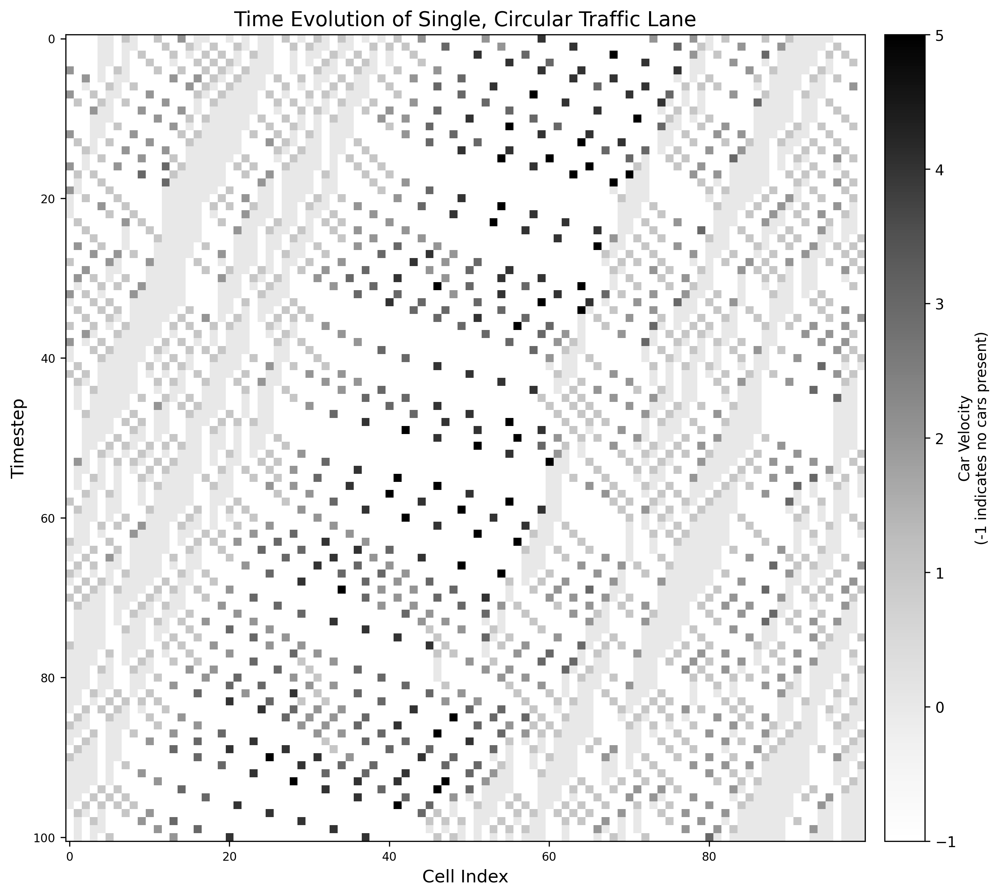
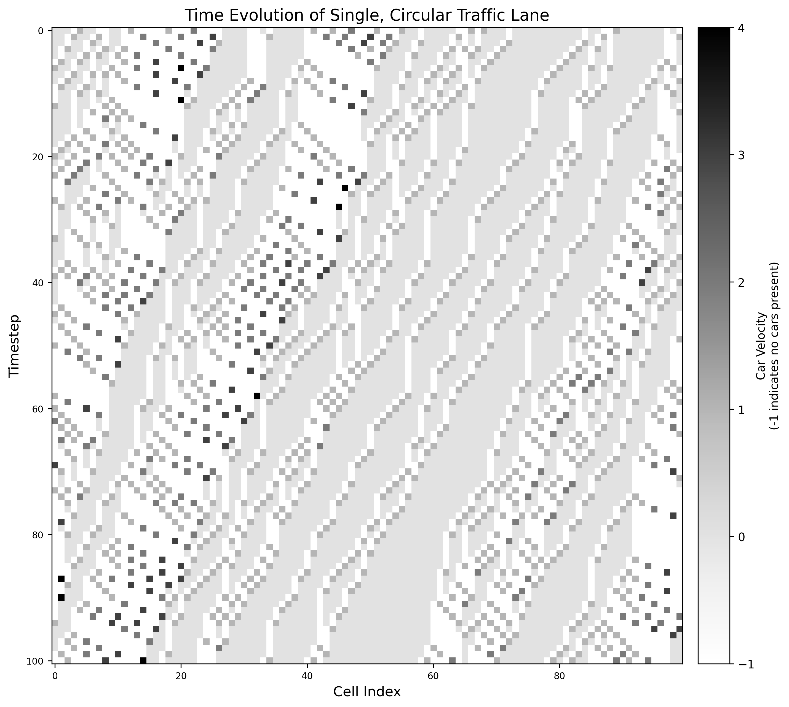
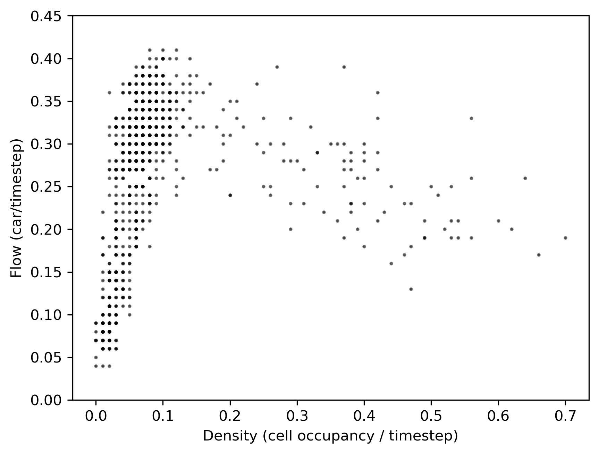
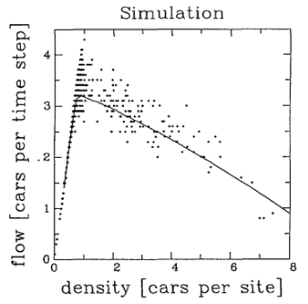
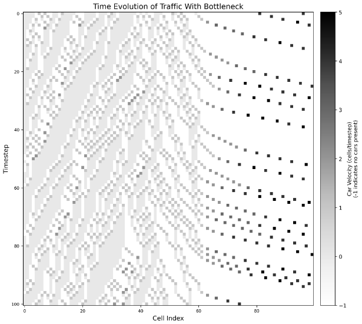

# Exploring the Nagel-Schreckenberg Traffic Model

## Installation Instructions
==This. (prob include needing numpy and matplotlib ?)==

## Background

The Nagel-Schreckenberg model is a framework for modeling single lane traffic flow based on theoretical cellular automata. There are a few simple rules for the model that are all followed simultaneously in each step, which is how the simple rules are used to create more complex patterns. The probability rule is what makes this model “lifelike”, as it accounts for the human aspect of how traffic is created. People get distracted, overreact to brake lights, see obstructions in the road, etc., and that’s often how traffic gets started. The transition from free flowing traffic to congestion (“stop-start waves”) shows how traffic disruptions cascade down the road due to one single car’s fluctuation in speed.

## Governing Rules

The Nagel-Schleckenberg traffic model is defined by four rules that govern the movement of "cars" through the simulation. These rules account for normal traffic movement as well as adding in potential human factors that make this model much more life-like and accurate. The rules, which are all followed simulataneously as the model progresses through each time step, are as follows:
1. Cars that aren't at their maximum velocity ($v ≠ v_{max}$) and have adequate space in front of them ($d$ > $v + 1$) will increase their speed by one.
2. If the distance to the next car $d < v$, then $v$ is reduced by one unit.
3. For any moving vehicle (vehicles with v > 0), there is a braking probability $p$ that the velocity will be randomly decreased by one unit.
4. All cars move forward by $v$ cells.

Additionally, the base model is "binary" in a way, where a cell either has a car in it or it doesn't.

## Circular vs. Bottleneck Systems

The base Nagel-Schreckenberg model can be used in a variety of circumstances and with a variety of conditions. For this particular project, the circular and bottleneck N-S systems were examined.

### Circular System

The circular or infinite loop version of the model is defined mainly by the density of cars on the road, think "racetrack". This density can be altered to simulate different traffic conditions. Because the loop is closed, the density remains constant throughout the entirety of the simulation. This version of the model eliminates "edge effects" like traffic lights, car crashes, and other anomalies entering and leaving the system, it purely isolates traffic jam formation due to driver interactions and braking/accelerating.

You start by inputting a fixed density $\rho$ where $\rho = {N \over L} = {Number\ of\ cars\ \over Number\ of\ cells}$, as well as the number of cells you want in your traffic loop. Then, the cars are randomly placed throughout the lane with an initial velocity $v = 0$.

The equations that define the density and flow of the system are defined below. (From Nagel, Schreckenberg (1992))

Density: $\bar {\rho}^T = \frac{1}{T} \sum_{t=t_0+1}^{t_0+T} n_{i}(t)$   and     $\lim_{T \to \infty} \bar{\rho}^T = \rho$

Flow: $\bar{q}^T = \frac{1}{T} \sum_{t=t_0+1}^{t_0+T} n_{i,i+1}(t)$

- $n$ represents the "occupation number", it is 1 when the cell is occupied and 0 when it is not

### Bottleneck System

The bottleneck or open system simulates a non-constant density situation. The boundary conditions of the system are redefined to create open boundaries. The model adds cars on the left when a space opens up, and deletes cars on the right when they've reached their "destination". This simulates bottleneck situations like a reduction in speed limit in a particular part of a road. Once the cars get past this bottleneck, they are opened up into free flow again. Where the circular system studies how "phantom" traffic jams are formed, this system studies how differing road conditions and restrictions limit the flow of traffic.

As with the circular system, the cars added to the left side begin with an initial velocity $v=0$, and the same rules from above apply with the addition of the bottleneck condition.

## Results

The results of the simulations and their respective plots can be seen below. The clear, wave-like patterns show the cascading effect of traffic, as time progresses the traffic moves backwards.

### Changes in Braking Probability, Circular Model
Range of probabilities: 0.25, 0.50, 0.75

  
   
  

Traffic density was kept constant, $\rho = 0.25$

### Changes in Traffic Density, Circular Model
Range of densities: 0.10, 0.35, 0.60

  
   
  

Braking probability was kept constant, $p = 0.5$

  
 
  <caption> Density vs. Flow </caption>

The density and flow that were used to create this plot are defined by the functions in the Circular System section above. This plot can be compared to the original N-S model's plot (seen below) to ensure the simulation is working.

  
 
  <caption> Density vs. Flow from Nagel, Schreckenberg (1992) </caption>

### Bottleneck Model

    

#### Notes on Interpreting the Plots
- Traffic is moving from left to right.
- White spaces are empty. (represented by a $v$ value of -1)
- The darker the point, the higher the car's velocity.

## Future Directions and Applications

Both the circular and bottleneck systems can be applied to different situations to simulate and study traffic formation. The parameters of these models allow for a variety of situations to be examined at a base level. An extension from the base single-lane N-S model would be a multi-lane system. This model would follow similar guidelines to the single-lane system, with the addition of a new set of parameters that defines how, when, and how often cars switch from one lane to another. A multi-lane model would be much more applicable to modern day traffic, as most roads that are impacted by traffic are multi-lane roads.

## Directory:

`code/nsmodel.py` implements the base (circular) Nagel-Schreckenberg cellular automaton model and the additional bottleneck model

`demos/demo.ipynb` demonstrates how to use the analysis functions to plot the traffic models and tamper with the various parameters

`demos/analysis.py` implements the streamlined functions for analyzing the models in demo.ipynb

## Project Member Contributions:

**<ins>Kristine Anderson</ins>** implemented the base Nagel-Schreckenberg model, led the model simulation/plotting, and co-led the demo notebook.

**<ins>Srija Lahiri</ins>** implemented the bottleneck Nagel-Schreckenberg model and co-led the demo notebook.

**<ins>Nathan Safranek</ins>** assisted in the model simulation/plotting and led the README.md file.

## References

* Kai Nagel, Michael Schreckenberg. A cellular automaton model for freeway traffic. Journal de Physique I, 1992, 2 (12), pp.2221-2229. https://hal.science/jpa-00246697/document

* Nagel-Schreckenberg model. Wikipedia, 2025. https://en.wikipedia.org/wiki/Nagel%E2%80%93Schreckenberg_model
